# Rendu de Eddy Etame Etame

Une capture par étape, dans l'ordre. Terminal entier non rogné, invite visible.
Afficher l'historique en graphe quand c'est pertinent.

## Niveau 1
1. Configuration Git

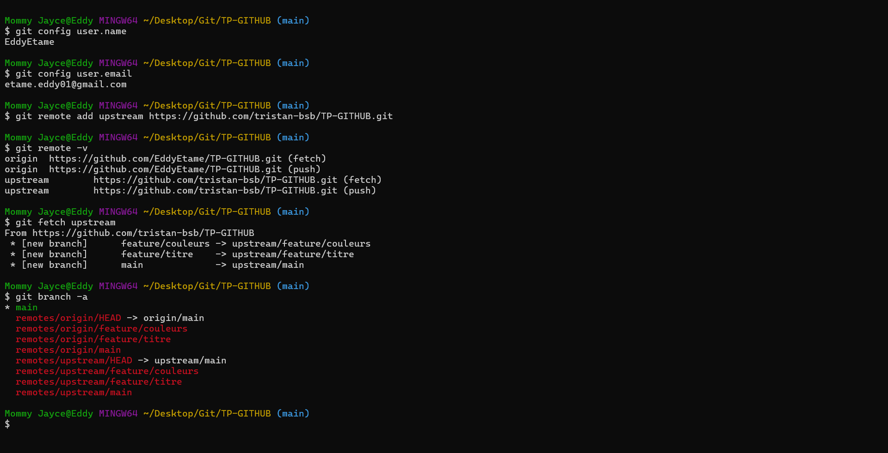

2. Branche de travail

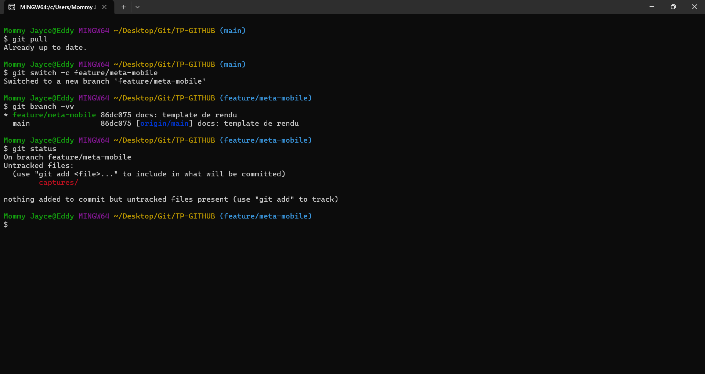

3. Historique des commits

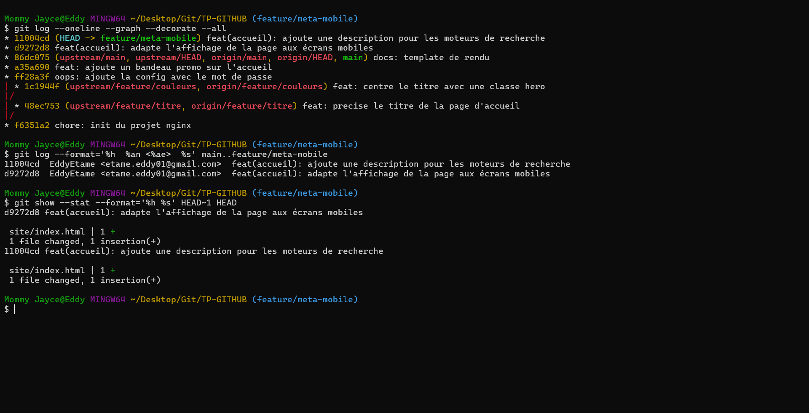

4. Pull Request

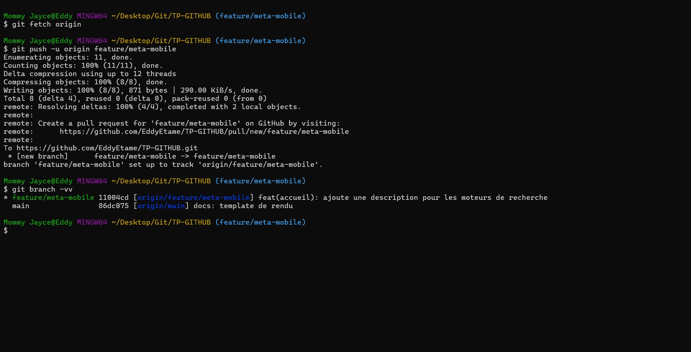

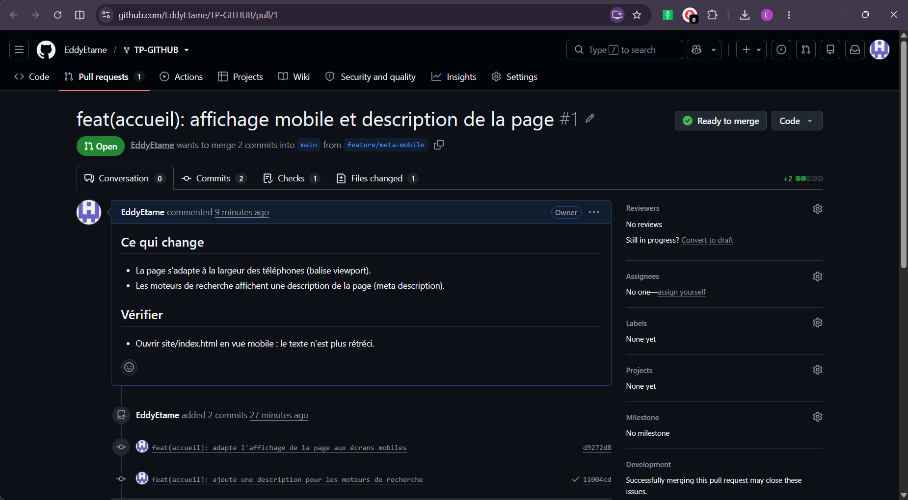

5. Revue croisée
(capture)

## Niveau 2
6. Secret retiré du suivi

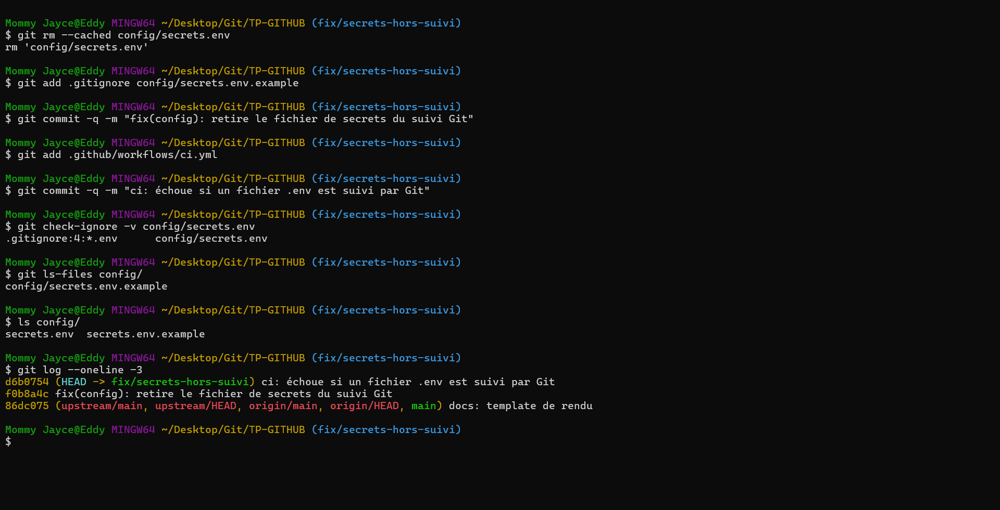

7. Conflit résolu (marqueurs avant, graphe après)

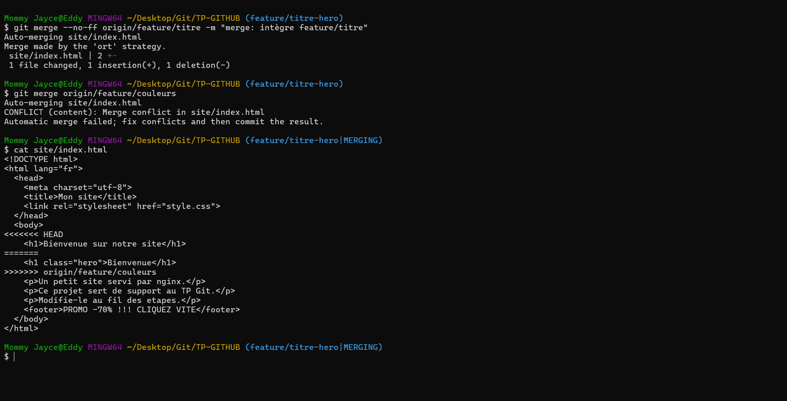

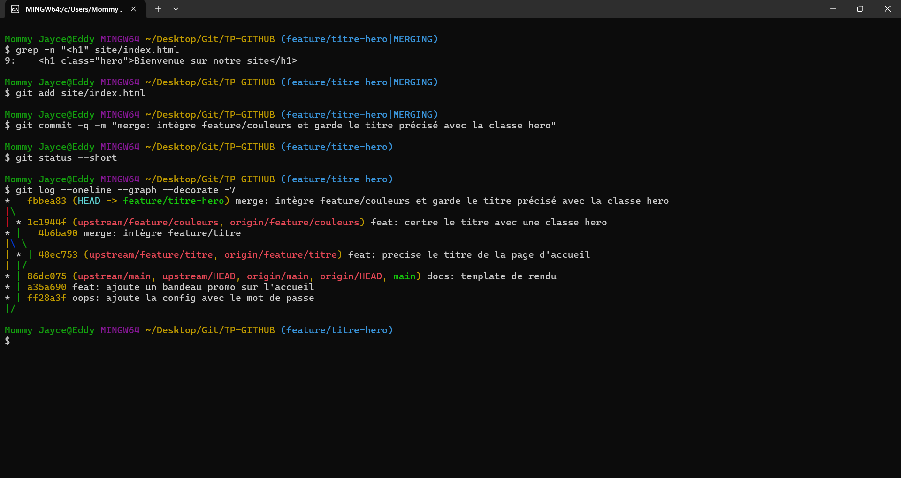

8. Revert du bandeau promo

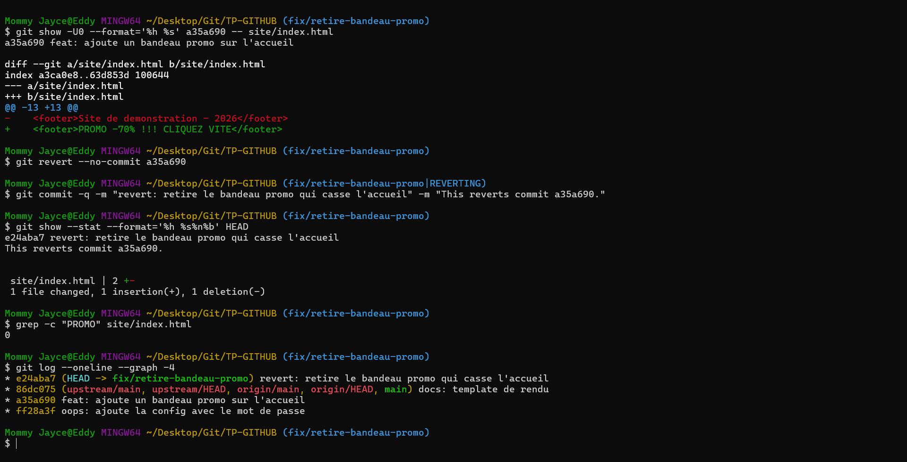

9. Issue fermée par une Pull Request

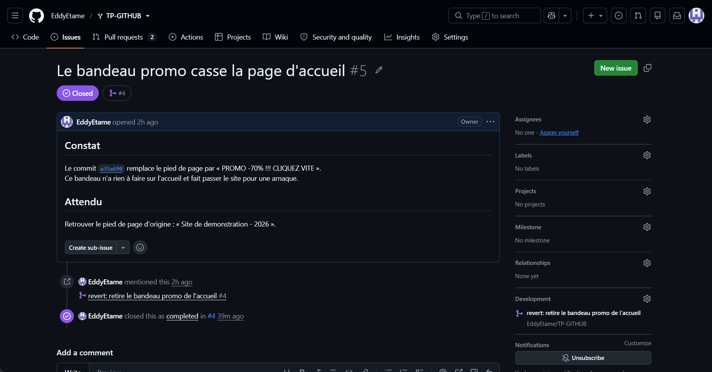

10. Protection de main et CI au vert

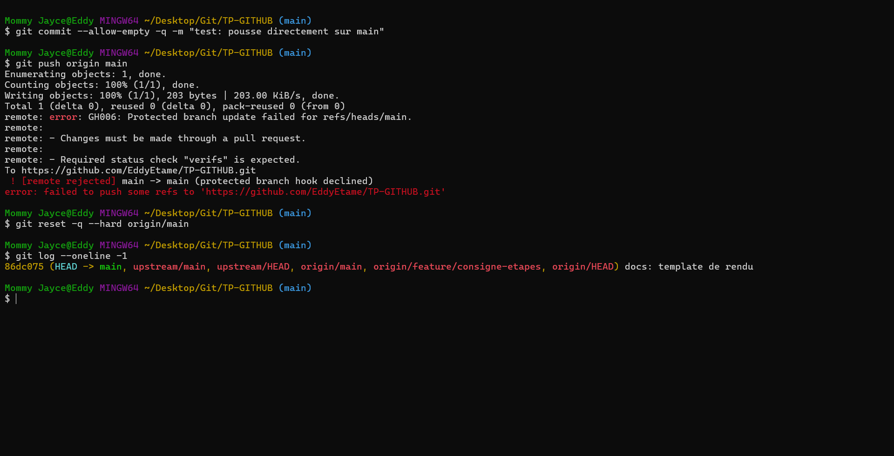

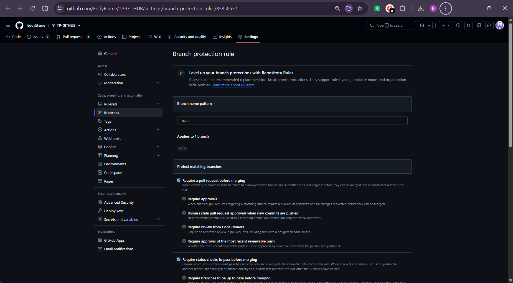

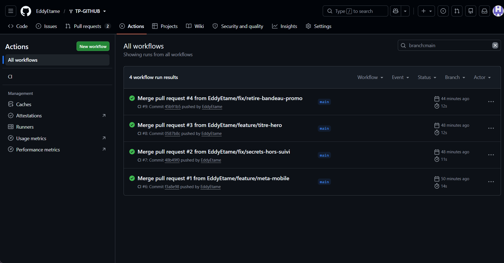

## Cible mobile
11. Commit distant récupéré et conflit résolu

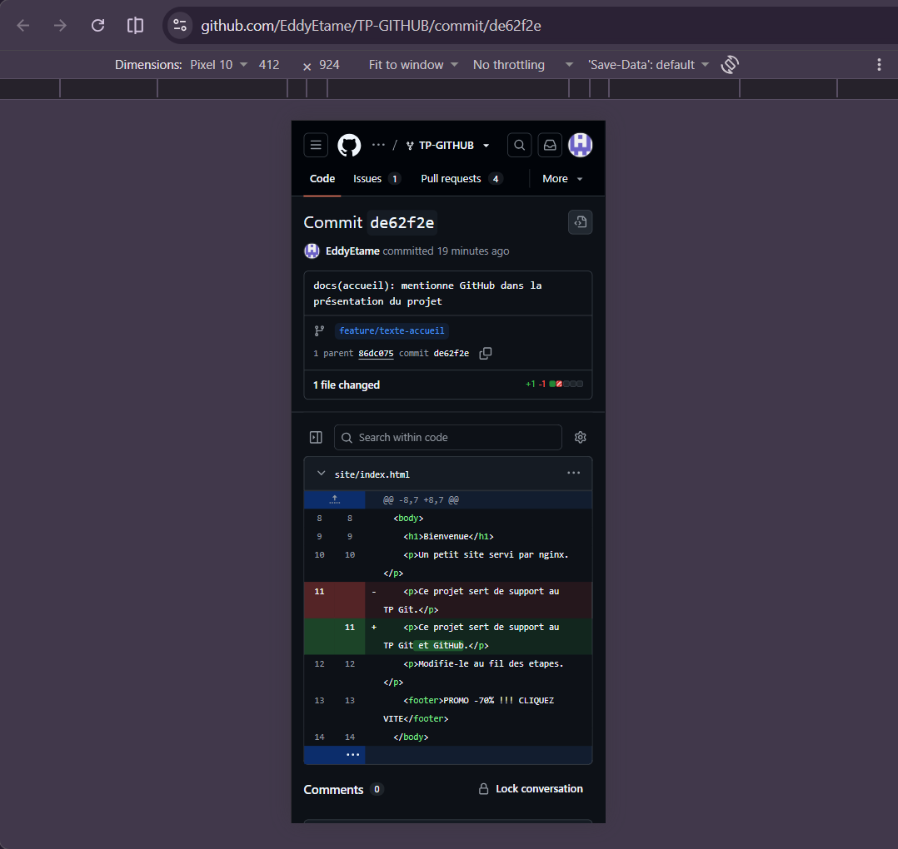

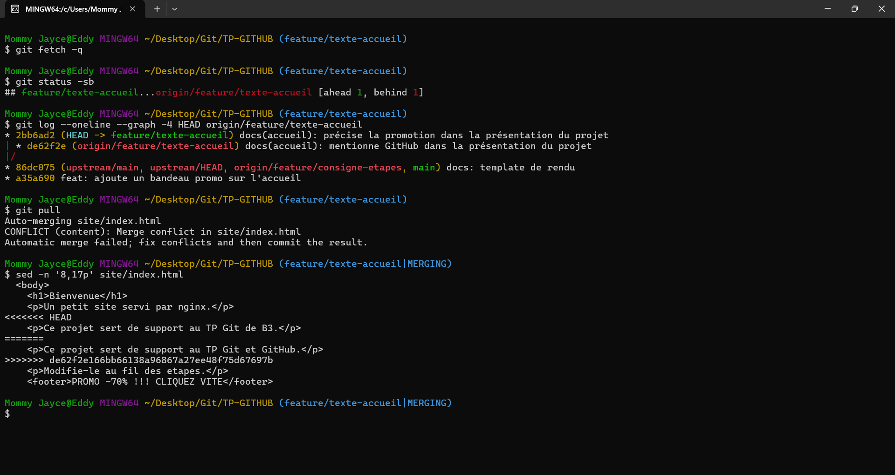

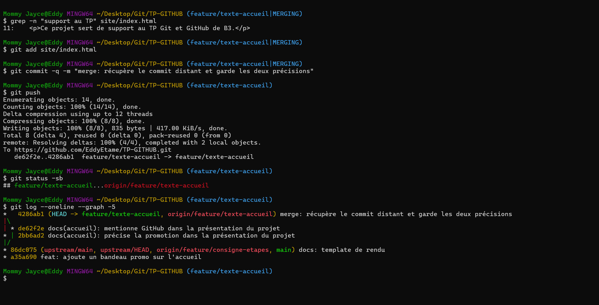

## Trois commits annotés
1. `f0b8a4c` : `git rm --cached` sort `config/secrets.env` du suivi sans le supprimer du disque. `.gitignore` ignore désormais `*.env` (sauf `*.env.example`) et un modèle vide indique les variables à remplir. Le mot de passe reste lisible dans l'historique (`ff28a3f`) : en situation réelle, il faut le changer.
2. `fbbea83` : commit de merge qui résout le conflit entre `feature/titre` et `feature/couleurs`. Les deux branches modifiaient la même ligne `<h1>` ; j'ai gardé les deux intentions : `<h1 class="hero">Bienvenue sur notre site</h1>`.
3. `e24aba7` : `git revert` de `a35a690`. Un nouveau commit annule le bandeau promo sans réécrire l'historique de `main`, ce qui reste sûr sur une branche partagée, contrairement à `git reset`.
